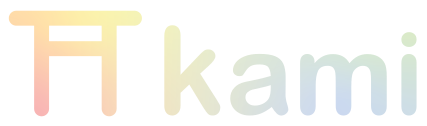

     

  
  
  

Kami is a work-in-progress 3D and 2D game engine opting for simplicity in usage and implenentation wherever possible.
While in its early stages, Kami is currently not in a usable state however it is quickly evolving. 
Kami is my personal exploration and continuation of my own endeavors in game programming, design, and creativity.

Goals:

- ease of use (primarily scripting, no UI)
- robust, beauty focused graphics system
- story-driven systems
- efficient and proven essential systems (ECS: entt, graphics: vulkan)
- procedural asset generation (terrain, story, and audio)

Features:
- 3D rendering (2D is trivially implemented in the future)
- smart resource manager (WIP)
- ECS API (WIP, through EnTT)
- uniform buffer and push constant support (Vulkan)
- intuitive primarily singleton-based scripting API (major WIP, but trivial in that it only needs cleanup)
